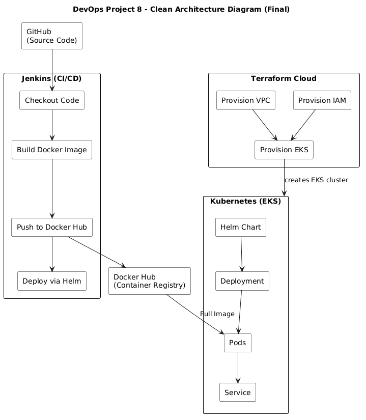
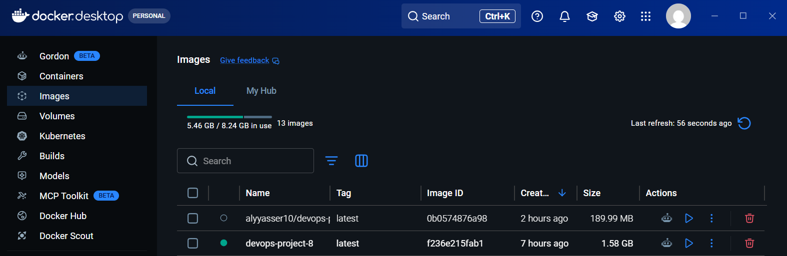
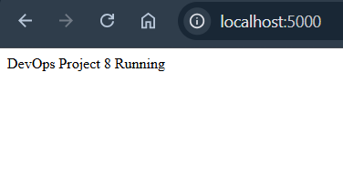

# DevOps Project 8 — End-to-End CI/CD Pipeline on AWS EKS


## Overview
This project demonstrates a complete DevOps lifecycle by automating infrastructure provisioning, application build, containerization,
and deployment to Kubernetes.
It simulates a real-world production pipeline where every step—from code push to deployment—is automated, reproducible, and scalable.

## Architecture


## Deployment Flow
```text
Code Push --> Jenkins --> Docker Build --> Docker Hub --> Helm Deploy --> Kubernetes
```

## Tech Stack

| Category         | Tools                       |
| ---------------- | --------------------------- |
| Cloud            | AWS (EKS)                   |
| Infrastructure   | Terraform (Terraform Cloud) |
| CI/CD            | Jenkins   (automation)      |
| Containerization | Docker    (App packaging)   |
| Orchestration    | Kubernetes (App runtime)    |
| Deployment       | Helm      (K8s templating)  |
| Application      | Node.js                     |


## CI/CD Pipeline (Jenkins)
The Jenkins pipeline automates the full workflow:

### Pipeline Stages

1. **Checkout**
   * Pulls source code from GitHub

2. **Build Image**
   * Builds Docker image from application

3. **Push Image**
   * Authenticates with Docker Hub
   * Pushes image to registry

4. **Deploy**
   * Uses Helm to deploy/update application on Kubernetes
   * Executed inside Jenkins workspace using relative path

## Docker

#### Build Image
```bash
docker build -t alyyasser10/devops-project-8:latest .
```

#### Push Image
```bash
docker push alyyasser10/devops-project-8:latest
```


## Deploy via Helm
I had old helm app and upgraded it in this project
```bash
helm upgrade --install my-app ./helm/my-app
```


## Infrastructure (Terraform)
Terraform provisions:
* VPC
* Subnets
* Internet Gateway
* Route Tables
* IAM Roles
* EKS Cluster
* Node Group


## Credentials Management
Sensitive data handled securely:

### Jenkins Credentials
* `dockerhub-creds` → Docker Hub authentication
* `kubeconfig` → Kubernetes cluster access

### Terraform Cloud Variables
* `AWS_ACCESS_KEY_ID`
* `AWS_SECRET_ACCESS_KEY`


## Project Screenshots

### 1️) Terraform Cloud — Infrastructure Provisioning
* Provisioning AWS infrastructure (EKS, VPC, IAM) using Terraform Cloud
.png)

### 2️) Jenkins Pipeline — CI/CD Execution
* CI/CD pipeline building Docker image, pushing to Docker Hub, and deploying to Kubernetes using Helm
.png)

### 3️) Docker Image — Build & Push
* Docker image successfully built and stored (ready for deployment)


### 4️) Kubernetes Cluster — Nodes Running
* EKS cluster nodes running and ready
.png)

### 5️) Running Application
* Application successfully deployed and running on Kubernetes



## Key Achievements
* Built full CI/CD pipeline using Jenkins
* Automated Docker image build and push
* Deployed application to Kubernetes using Helm
* Provisioned AWS infrastructure using Terraform
* Integrated Terraform Cloud for remote execution
* Achieved end-to-end DevOps workflow

## Lessons Learned
* Importance of Terraform state management
* Handling IAM conflicts and resource duplication
* Debugging CI/CD pipelines effectively
* Kubernetes deployment and troubleshooting
* Integrating multiple DevOps tools into one workflow

## Author
Ali Yasser
